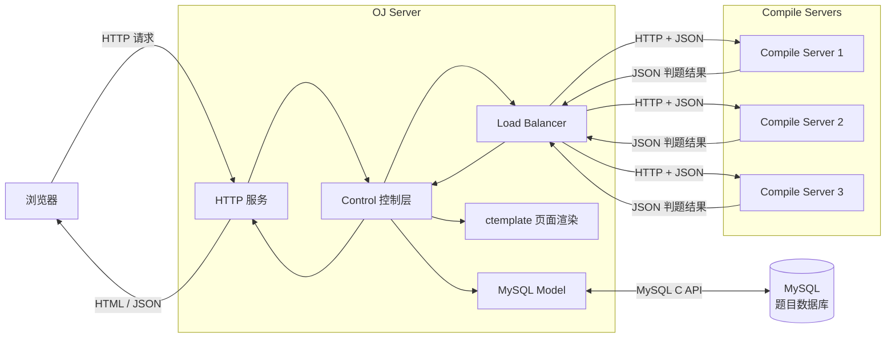
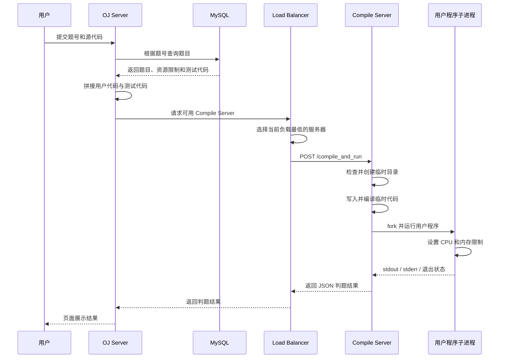

# load-balanced-online-judge

> A load-balanced online judge system implemented in C++11.

基于 **C++11、Linux、cpp-httplib、JsonCpp、ctemplate 和 MySQL** 实现的负载均衡式在线判题系统。

项目采用 **OJ Server 与 Compile Server 分离**的服务架构，提供题目管理、在线代码编辑、代码提交、编译运行、资源限制、判题结果返回、编译服务器负载均衡和故障转移等功能。

`v1.1.0` 将题目数据从本地文件迁移至 MySQL，并完善了数据库初始化、临时工作目录管理、运行状态判断、服务端口配置和部署打包流程。

## 项目状态

- 当前版本：`v1.1.0`
- 初始题目数量：15
- 编程语言：C++11
- 运行平台：Linux
- 服务间通信：HTTP + JSON
- 页面渲染：ctemplate
- 题目存储：MySQL
- 数据库字符集：utf8mb4
- 构建工具：Makefile
- 部署方式：OJ Server 与 Compile Server 分离部署

## v1.1.0 更新内容

- 将题目元数据、题目描述、初始代码和测试代码迁移至 MySQL
- 增加 `questions` 数据表和 15 道初始题目数据
- 使用 MySQL C API 查询全部题目和指定题目
- 使用 `utf8mb4` 字符集保存中文题目内容
- 使用 `OJ_MYSQL_PASSWD` 环境变量读取数据库密码
- 对题目编号进行数字合法性检查
- Compile Server 支持通过命令行参数指定监听端口
- 服务启动和请求处理时自动检查并创建临时工作目录
- 完善 JSON 格式错误、资源限制参数错误和运行信号提示
- 修复编译失败后可能误用旧可执行程序的问题
- 增加根目录统一编译、清理和部署打包命令
- 部署目录中包含 MySQL 初始化脚本和 OJ Server 启动脚本

## 项目亮点

- 将 OJ 业务服务和代码编译运行服务拆分为独立服务
- 使用 HTTP 完成 OJ Server 与 Compile Server 之间的通信
- 使用 JsonCpp 完成判题请求和响应的 JSON 处理
- 使用 ctemplate 渲染题目列表和题目详情页面
- 使用 MySQL 统一存储题目信息、初始代码和测试代码
- 使用 MySQL C API 完成数据库连接、查询和结果集解析
- 使用环境变量保存数据库密码，避免敏感信息进入公开仓库
- 使用 `fork` 创建独立子进程编译和运行用户程序
- 使用 `exec` 启动编译器和用户可执行程序
- 使用 `dup2` 重定向标准输入、标准输出和标准错误
- 使用 `setrlimit` 限制用户程序的 CPU 时间和虚拟内存
- 使用唯一临时文件名隔离不同判题请求
- 请求处理完成后自动清理临时文件
- 根据活动判题请求数量选择当前负载最低的编译服务器
- 编译服务器请求失败后自动将其离线并尝试其他服务器
- 对编译错误、运行错误和常见 Linux 信号返回明确提示
- 使用根目录 Makefile 统一完成编译、清理和部署打包

## 技术栈

| 技术 | 用途 |
| --- | --- |
| C++11 | 项目主要开发语言 |
| Linux | 编译、运行和部署环境 |
| cpp-httplib | HTTP 服务和服务间通信 |
| JsonCpp | 判题请求和响应的 JSON 处理 |
| ctemplate | HTML 页面模板渲染 |
| MySQL 8.0 | 题目数据持久化 |
| MySQL C API | C++ 服务连接 MySQL 并解析查询结果 |
| libmysqlclient | MySQL 客户端链接库 |
| utf8mb4 | 保存中文题目和代码内容 |
| pthread | HTTP 服务多线程支持 |
| `fork` | 创建编译和运行子进程 |
| `exec` | 启动编译器和用户可执行程序 |
| `dup2` | 重定向标准输入、输出和错误 |
| `setrlimit` | 限制 CPU 时间和虚拟内存 |
| Makefile | 统一构建、清理和部署打包 |

## 系统架构



## 核心模块

### OJ Server

OJ Server 负责处理在线判题系统的主要业务：

- 提供题目列表页面
- 提供题目详情页面
- 接收用户提交的 C++ 代码
- 从 MySQL 查询题目和测试代码
- 拼接用户代码与测试代码
- 选择合适的 Compile Server
- 转发编译运行请求
- 接收并返回判题结果
- 使用 ctemplate 渲染 HTML 页面

### Compile Server

Compile Server 负责用户代码的编译和运行：

- 接收 OJ Server 发送的 JSON 请求
- 检查请求字段和资源限制参数
- 自动创建临时工作目录
- 生成唯一临时文件名
- 将用户代码写入临时源文件
- 创建子进程并调用 G++ 编译代码
- 创建独立子进程运行用户程序
- 限制 CPU 时间和虚拟内存
- 重定向标准输入、标准输出和标准错误
- 收集编译错误、运行输出和退出状态
- 生成 JSON 判题结果
- 请求结束后清理临时文件

### MySQL Model

MySQL Model 负责题目数据访问：

- 连接 MySQL 数据库
- 从环境变量获取数据库密码
- 设置连接字符集为 `utf8mb4`
- 查询全部题目
- 根据题号查询指定题目
- 检查查询结果字段数量
- 处理数据库中的空字段
- 释放查询结果和数据库连接

### Load Balancer

Load Balancer 负责 Compile Server 调度：

- 从配置文件读取 Compile Server 地址
- 保存在线和离线服务器列表
- 记录每台服务器当前正在处理的请求数量
- 优先选择当前负载最低的在线服务器
- 请求开始时增加服务器负载
- 请求完成时减少服务器负载
- HTTP 请求失败时将服务器标记为离线
- 自动尝试其他在线 Compile Server

## 判题流程



## 编译运行流程

```text
接收 JSON 请求
      │
      ▼
检查 JSON 字段
      │
      ▼
检查 CPU 和内存限制
      │
      ▼
检查并创建临时目录
      │
      ▼
生成唯一临时文件名
      │
      ▼
写入源代码和标准输入
      │
      ▼
fork 创建编译子进程
      │
      ▼
exec 启动 g++
      │
      ├── 编译失败 ──> 读取编译错误
      │
      ▼
生成可执行程序
      │
      ▼
fork 创建运行子进程
      │
      ├── 设置 CPU 时间限制
      ├── 设置虚拟内存限制
      ├── 重定向标准输入
      ├── 重定向标准输出
      ├── 重定向标准错误
      └── exec 运行用户程序
      │
      ▼
父进程等待运行子进程
      │
      ▼
分析退出状态和信号
      │
      ▼
读取标准输出和标准错误
      │
      ▼
生成 JSON 判题结果
      │
      ▼
清理临时文件
```

## MySQL 题目管理

`v1.1.0` 使用 MySQL 统一保存题目数据，不再依赖运行目录中的题目配置文件加载题库。

### 数据表结构

`questions` 表包含以下字段：

| 字段 | 类型 | 作用 |
| --- | --- | --- |
| `number` | `int` | 题目编号和主键 |
| `title` | `varchar(64)` | 题目标题 |
| `star` | `varchar(8)` | 题目难度 |
| `question_desc` | `text` | 题目描述 |
| `header` | `text` | 提供给用户的初始代码 |
| `tail` | `text` | 与用户代码拼接的测试代码 |
| `time_limit` | `int` | CPU 时间限制，单位为秒 |
| `mem_limit` | `int` | 内存限制，单位为 KB |

数据库初始化脚本位于：

```text
oj_server/sql/oj.sql
```

该脚本包含：

- 创建 `oj` 数据库
- 创建 `questions` 数据表
- 设置 `utf8mb4` 字符集
- 导入 15 道初始题目

### 查询流程

查询全部题目：

```sql
SELECT * FROM questions;
```

根据编号查询指定题目：

```sql
SELECT * FROM questions WHERE number = 1;
```

当前实现会在拼接 SQL 前检查题目编号是否全部由数字组成，避免非法字符串直接进入查询语句。

### 数据库连接配置

当前数据库连接参数：

```text
Host:     127.0.0.1
Port:     3306
Database: oj
User:     oj_client
```

数据库密码不写入源代码，而是从以下环境变量读取：

```text
OJ_MYSQL_PASSWD
```

启动 OJ Server 前需要设置：

```bash
export OJ_MYSQL_PASSWD='your_mysql_password'
```

> 不要将真实数据库密码写入源代码、README 或 Git 提交。

## 负载均衡策略

每台 Compile Server 维护一个当前负载值：

```text
load = 当前正在处理的判题请求数量
```

假设当前负载为：

```text
Compile Server 1: load = 3
Compile Server 2: load = 1
Compile Server 3: load = 2
```

Load Balancer 会选择：

```text
Compile Server 2
```

请求开始时：

```text
load++
```

请求结束时：

```text
load--
```

如果向某台 Compile Server 发送 HTTP 请求失败：

```text
HTTP 请求失败
      │
      ▼
重置服务器负载
      │
      ▼
移出在线服务器列表
      │
      ▼
加入离线服务器列表
      │
      ▼
继续选择其他在线服务器
```

> 当前实现根据活动请求数量选择最低负载服务器，不是根据 CPU 使用率、内存使用率或 Linux Load Average 进行调度。

## 错误处理

Compile Server 可以识别并返回以下结果：

| 状态 | 说明 |
| --- | --- |
| 编译运行成功 | 用户代码成功完成编译和运行 |
| 代码为空 | 用户没有提交代码 |
| JSON 格式错误 | 请求缺少必要字段或 JSON 无法解析 |
| 编译错误 | G++ 编译失败并返回编译器错误信息 |
| 资源参数错误 | CPU 或内存限制小于等于 0 |
| 非零退出 | 用户程序主动以非零状态结束 |
| `SIGILL` | 用户程序执行非法指令 |
| `SIGABRT` | 用户程序异常终止 |
| `SIGXCPU` | 用户程序超过 CPU 时间限制 |
| `SIGFPE` | 用户程序发生算术异常 |
| `SIGSEGV` | 用户程序发生非法内存访问 |
| `SIGBUS` | 用户程序发生总线错误 |
| `SIGKILL` | 用户程序被强制终止 |
| 内部错误 | 文件、目录、进程或服务内部操作失败 |

## HTTP 接口

### OJ Server

| 请求方式 | 路径 | 作用 |
| --- | --- | --- |
| `GET` | `/all_questions` | 获取全部题目页面 |
| `GET` | `/question/{number}` | 获取指定题目页面 |
| `POST` | `/judge/{number}` | 提交代码并获取判题结果 |

### Compile Server

| 请求方式 | 路径 | 作用 |
| --- | --- | --- |
| `POST` | `/compile_and_run` | 编译并运行完整 C++ 代码 |

## 判题请求

OJ Server 发送给 Compile Server 的 JSON 请求：

```json
{
    "code": "#include <iostream>\nint main() { return 0; }",
    "input": "",
    "cpu_limit": 1,
    "mem_limit": 131072
}
```

字段说明：

| 字段 | 作用 |
| --- | --- |
| `code` | 需要编译和运行的完整 C++ 代码 |
| `input` | 提供给用户程序的标准输入 |
| `cpu_limit` | CPU 时间限制，单位为秒 |
| `mem_limit` | 虚拟内存限制，单位为 KB |

## 判题响应

Compile Server 返回 JSON 结果：

```json
{
    "status": 0,
    "reason": "编译运行成功",
    "stdout": "",
    "stderr": ""
}
```

字段说明：

| 字段 | 作用 |
| --- | --- |
| `status` | 编译或运行状态码 |
| `reason` | 状态对应的文字说明 |
| `stdout` | 用户程序的标准输出 |
| `stderr` | 用户程序的标准错误 |

## 项目目录

```text
load-balanced-online-judge/
├── common/                         # 公共工具
│   ├── httplib.h                   # HTTP 服务库
│   ├── log.hpp                     # 日志模块
│   └── util.hpp                    # 文件、路径和时间工具
├── compile_server/                 # 编译运行服务
│   ├── compile_server.cc           # Compile Server 入口
│   ├── compile_run.hpp             # 编译运行总流程
│   ├── compiler.hpp                # 编译模块
│   ├── runner.hpp                  # 子进程运行和资源限制
│   ├── temp/                       # 判题临时工作目录
│   └── Makefile
├── oj_server/                      # OJ 业务服务
│   ├── oj_server.cc                # OJ Server 入口
│   ├── oj_control.hpp              # 业务控制和负载均衡
│   ├── oj_model.hpp                # 原文件式题目 Model
│   ├── oj_model2.hpp               # MySQL 题目 Model
│   ├── oj_view.hpp                 # 页面模板渲染
│   ├── conf/
│   │   └── service_machine.conf    # Compile Server 配置
│   ├── sql/
│   │   └── oj.sql                  # 数据库结构和初始题目
│   ├── template_html/              # ctemplate 页面模板
│   ├── wwwroot/                    # 前端静态资源
│   └── Makefile
├── Makefile                        # 统一构建和部署打包
├── .gitignore
└── README.md
```

> `output/` 为 `make output` 自动生成的部署目录，不提交到 Git 仓库。

## 环境要求

推荐环境：

- Ubuntu 22.04 / 24.04
- GCC / G++
- GNU Make
- MySQL 8.0
- MySQL Client Development Library
- JsonCpp
- ctemplate
- pthread

## 安装依赖

```bash
sudo apt update

sudo apt install -y \
    build-essential \
    make \
    mysql-server \
    default-libmysqlclient-dev \
    libjsoncpp-dev \
    libctemplate-dev
```

检查 MySQL 开发环境：

```bash
mysql_config --version
mysql_config --include
mysql_config --libs
```

## 编译运行

### 1. 克隆项目

```bash
git clone git@github.com:HaoPing0124/load-balanced-online-judge.git

cd load-balanced-online-judge
```

### 2. 启动 MySQL

```bash
sudo systemctl enable --now mysql
```

检查 MySQL 状态：

```bash
sudo systemctl status mysql
```

按 `q` 退出状态页面。

### 3. 初始化数据库

在项目根目录执行：

```bash
sudo mysql < oj_server/sql/oj.sql
```

检查数据库：

```bash
sudo mysql
```

进入 MySQL 后执行：

```sql
USE oj;

SHOW TABLES;

SELECT number, title, star, time_limit, mem_limit
FROM questions;

EXIT;
```

### 4. 创建 OJ 数据库用户

进入 MySQL：

```bash
sudo mysql
```

执行以下 SQL：

```sql
CREATE USER IF NOT EXISTS 'oj_client'@'127.0.0.1'
IDENTIFIED BY 'your_mysql_password';

GRANT SELECT ON oj.* TO 'oj_client'@'127.0.0.1';

FLUSH PRIVILEGES;

EXIT;
```

请将：

```text
your_mysql_password
```

替换为你自己设置的数据库密码。

### 5. 准备 MySQL 头文件和链接库

当前 `oj_server/Makefile` 使用本地 `include` 和 `lib` 路径。

在项目根目录执行：

```bash
cd oj_server

[ -L include ] && rm include
[ -L lib ] && rm lib

[ -e include ] || \
ln -s "$(mysql_config --include | sed 's/^-I//')" include

[ -e lib ] || \
ln -s "$(mysql_config --libs | tr ' ' '\n' | sed -n 's/^-L//p' | head -n 1)" lib

cd ..
```

检查软链接：

```bash
ls -l oj_server/include
ls -l oj_server/lib
```

### 6. 编译全部服务

在项目根目录执行：

```bash
make
```

该命令会依次编译：

```text
compile_server
oj_server
```

### 7. 启动 Compile Server

配置文件默认包含：

```text
127.0.0.1:8081
127.0.0.1:8082
127.0.0.1:8083
```

打开第一个终端：

```bash
cd load-balanced-online-judge/compile_server

./compile_server 8081
```

打开第二个终端：

```bash
cd load-balanced-online-judge/compile_server

./compile_server 8082
```

打开第三个终端：

```bash
cd load-balanced-online-judge/compile_server

./compile_server 8083
```

Compile Server 必须传入监听端口：

```text
./compile_server <port>
```

### 8. 配置 Compile Server 地址

配置文件：

```text
oj_server/conf/service_machine.conf
```

默认配置：

```text
127.0.0.1:8081
127.0.0.1:8082
127.0.0.1:8083
```

部署到不同主机时，可以修改为：

```text
192.168.1.101:8081
192.168.1.102:8081
192.168.1.103:8081
```

### 9. 启动 OJ Server

打开新的终端：

```bash
cd load-balanced-online-judge/oj_server
```

设置数据库密码：

```bash
export OJ_MYSQL_PASSWD='your_mysql_password'
```

启动服务：

```bash
./oj_server
```

OJ Server 默认监听：

```text
0.0.0.0:8085
```

### 10. 访问系统

本机访问：

```text
http://127.0.0.1:8085/all_questions
```

远程服务器访问：

```text
http://<OJ_SERVER_IP>:8085/all_questions
```

如果部署在云服务器上，需要确认：

- 云服务器安全组已经放行 `8085`
- Linux 防火墙已经放行 `8085`
- OJ Server 正在正常运行
- MySQL 正在正常运行
- Compile Server 配置地址可以从 OJ Server 访问

## 统一构建与部署

### 编译全部服务

在项目根目录执行：

```bash
make
```

### 生成部署目录

```bash
make output
```

生成的主要目录：

```text
output/
├── compile_server/
│   ├── compile_server
│   └── temp/
└── oj_server/
    ├── conf/
    ├── lib/
    ├── sql/
    ├── template_html/
    ├── wwwroot/
    ├── oj_server
    └── start.sh
```

### 启动部署后的 Compile Server

```bash
cd output/compile_server

./compile_server 8081
```

其他 Compile Server：

```bash
./compile_server 8082
./compile_server 8083
```

### 启动部署后的 OJ Server

```bash
cd output/oj_server

export OJ_MYSQL_PASSWD='your_mysql_password'

./start.sh
```

`start.sh` 会设置本地 MySQL 客户端动态库搜索路径，然后启动 OJ Server。

### 清理编译和部署产物

在项目根目录执行：

```bash
make clean
```

## 安全边界说明

当前项目通过独立子进程运行用户代码，并使用 `setrlimit` 限制 CPU 时间和虚拟内存。

但是，当前实现还不是生产级代码安全沙箱。

生产环境还需要考虑：

- Linux Namespace
- cgroup
- seccomp
- 系统调用过滤
- 文件系统隔离
- 网络隔离
- 输出文件大小限制
- 子进程数量限制
- 非特权用户运行
- 容器隔离
- 判题任务超时回收
- 恶意代码检测

当前版本重点实现在线判题核心流程、进程编译运行、资源限制、MySQL 题目管理和 Compile Server 负载调度。

## 版本记录

### v1.1.0

- 使用 MySQL 保存题目数据
- 增加数据库初始化脚本
- 使用环境变量读取数据库密码
- Compile Server 支持命令行端口参数
- 自动创建临时工作目录
- 完善编译和运行错误处理
- 增加统一构建和部署打包

### v1.0.0

- 实现题目列表和题目详情页面
- 实现在线代码编辑和提交
- 实现代码编译运行服务
- 实现 CPU 和内存限制
- 实现最小负载 Compile Server 调度
- 实现 Compile Server 请求失败后的故障转移

## 后续计划

- 将 `oj_model2.hpp` 重构为正式的 `oj_model.hpp`
- 删除或归档旧的文件式题目 Model
- 将数据库地址、用户、端口和数据库名迁移至配置文件
- 使用 MySQL 预处理语句替代 SQL 字符串拼接
- 增加 MySQL 连接池
- 增加 Compile Server 定时健康检查
- 实现离线 Compile Server 自动恢复
- 将 OJ Server 监听端口改为可配置参数
- 增加用户程序输出大小限制
- 增加用户程序子进程数量限制
- 增加 Linux Namespace、cgroup 和 seccomp 隔离
- 增加压力测试、吞吐量统计和性能分析
- 增加 GitHub Actions 自动构建
- 增加 CMake 构建支持
- 继续扩充题库和测试用例