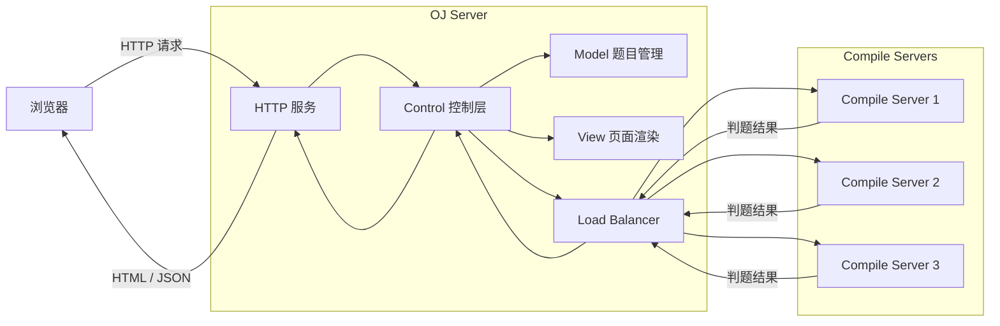
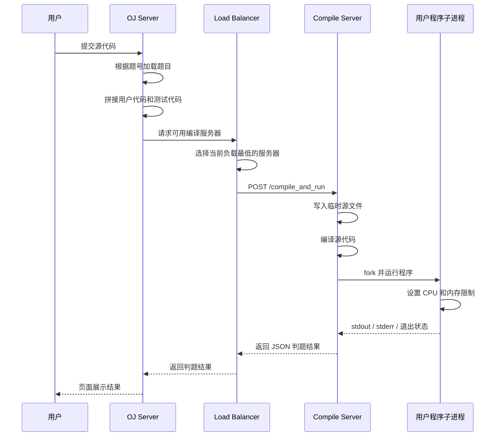

# load-balanced-online-judge

> A load-balanced online judge system implemented in C++11.

基于 **C++11、Linux、cpp-httplib、JsonCpp 和 ctemplate** 实现的负载均衡式在线判题系统。

项目提供题目展示、在线代码编辑、代码提交、编译运行、资源限制、判题结果返回、编译服务器负载均衡和故障转移等功能。

## 项目状态

- 当前版本：`v1.0.0`
- 当前题目数量：15
- 编程语言：C++11
- 运行平台：Linux
- 通信方式：HTTP + JSON
- 题目存储：配置文件和本地题目文件
- 构建工具：Makefile
- 当前核心判题流程已经测试通过

## 项目亮点

- 将 OJ 服务和编译运行服务拆分为独立进程
- 使用 HTTP 完成 OJ 服务与编译服务器之间的通信
- 使用 JsonCpp 序列化和反序列化判题请求
- 使用 ctemplate 渲染题目列表和题目详情页面
- 使用 `fork` 创建独立子进程运行用户程序
- 使用 `exec` 启动编译后的可执行程序
- 使用 `dup2` 重定向标准输入、标准输出和标准错误
- 使用 `setrlimit` 限制用户程序的 CPU 时间和内存
- 根据编译结果、退出状态和运行信号生成判题结果
- 使用唯一临时文件名隔离不同判题请求
- 请求处理结束后自动清理临时文件
- 根据服务器当前任务数选择负载最低的编译服务器
- 编译服务器请求失败后自动将其离线并重试其他服务器
- 使用 Model、View、Control 分层管理题目和页面渲染

## 技术栈

| 技术 | 用途 |
| --- | --- |
| C++11 | 项目主要开发语言 |
| Linux | 编译和运行环境 |
| cpp-httplib | HTTP 服务和服务间通信 |
| JsonCpp | 判题请求和响应的 JSON 处理 |
| ctemplate | HTML 页面模板渲染 |
| pthread | HTTP 服务多线程支持 |
| `fork` | 创建用户程序运行子进程 |
| `exec` | 运行编译后的可执行程序 |
| `dup2` | 重定向标准输入、输出和错误 |
| `setrlimit` | 限制 CPU 时间和内存 |
| Makefile | 项目编译与链接 |

## 系统架构



## 核心模块

### OJ Server

OJ 服务主要负责：

- 提供题目列表页面
- 提供题目详情页面
- 接收用户提交的代码
- 加载题目测试代码
- 选择编译服务器
- 转发判题请求
- 返回并展示判题结果

### Compile Server

编译服务器主要负责：

- 接收 JSON 判题请求
- 将用户代码写入临时源文件
- 调用编译器编译代码
- 创建子进程运行用户程序
- 限制 CPU 时间和内存
- 重定向输入、输出和错误
- 收集编译错误和运行错误
- 返回 JSON 判题结果
- 清理临时文件

### Load Balancer

负载均衡模块主要负责：

- 从配置文件加载编译服务器
- 保存在线和离线服务器列表
- 记录每台服务器的当前负载
- 选择当前负载最低的在线服务器
- 请求开始时增加服务器负载
- 请求结束时减少服务器负载
- 请求失败时将服务器标记为离线
- 自动继续尝试其他在线服务器

## 判题流程



## 编译运行流程

```text
接收 JSON 请求
      │
      ▼
检查用户代码
      │
      ▼
生成唯一临时文件名
      │
      ▼
写入 .cpp 源文件
      │
      ▼
调用 g++ 编译
      │
      ├── 编译失败 ──> 读取编译错误
      │
      ▼
生成可执行程序
      │
      ▼
fork 创建子进程
      │
      ├── 设置资源限制
      ├── 重定向标准输入
      ├── 重定向标准输出
      ├── 重定向标准错误
      └── exec 运行程序
      │
      ▼
父进程等待子进程
      │
      ▼
读取输出和错误
      │
      ▼
生成 JSON 结果
      │
      ▼
清理临时文件
```

## 负载均衡策略

每台编译服务器维护一个当前负载值：

```text
load = 当前正在处理的判题请求数量
```

假设当前负载为：

```text
Compile Server 1: load = 3
Compile Server 2: load = 1
Compile Server 3: load = 2
```

负载均衡器会选择：

```text
Compile Server 2
```

请求开始时：

```text
load++
```

请求结束时：

```text
load--
```

如果向某台编译服务器发送 HTTP 请求失败：

```text
请求失败
   │
   ▼
将服务器移出在线列表
   │
   ▼
加入离线服务器列表
   │
   ▼
继续选择其他在线服务器
```

> 当前实现属于基于活动请求数量的最小负载选择，不是 CPU 使用率、内存使用率或系统负载采样。

## 题目管理

每道题目包含：

- 题目编号
- 题目标题
- 难度
- CPU 时间限制
- 内存限制
- 题目描述
- 提供给用户的初始代码
- 用于判题的测试代码

题目配置示例：

```text
1 判断回文数 简单 1 30000
```

题目目录结构示例：

```text
questions/
├── questions.list
├── 1/
│   ├── desc.txt
│   ├── header.cpp
│   └── tail.cpp
├── 2/
│   ├── desc.txt
│   ├── header.cpp
│   └── tail.cpp
└── ...
```

OJ Server 启动时读取题目配置，并将题目信息加载到内存中。

## HTTP 接口

| 请求方式 | 路径 | 作用 |
| --- | --- | --- |
| `GET` | `/all_questions` | 获取全部题目页面 |
| `GET` | `/question/{number}` | 获取指定题目页面 |
| `POST` | `/judge/{number}` | 提交代码并获取判题结果 |
| `POST` | `/compile_and_run` | 编译并运行代码 |

## 判题请求

OJ Server 发送给 Compile Server 的 JSON 请求：

```json
{
    "code": "#include <iostream>\nint main() { return 0; }",
    "input": "",
    "cpu_limit": 1,
    "mem_limit": 30000
}
```

字段说明：

| 字段 | 作用 |
| --- | --- |
| `code` | 需要编译和运行的完整 C++ 代码 |
| `input` | 提供给用户程序的标准输入 |
| `cpu_limit` | CPU 时间限制，单位为秒 |
| `mem_limit` | 内存限制 |

## 判题响应

Compile Server 返回 JSON 结果：

```json
{
    "status": 0,
    "reason": "",
    "stdout": "",
    "stderr": ""
}
```

字段说明：

| 字段 | 作用 |
| --- | --- |
| `status` | 编译或运行状态 |
| `reason` | 状态对应的文字说明 |
| `stdout` | 用户程序的标准输出 |
| `stderr` | 用户程序的标准错误 |

## 项目目录

```text
load-balanced-online-judge/
├── common/                    # 公共工具
│   ├── httplib.h
│   ├── log.hpp
│   └── util.hpp
├── compile_server/            # 编译运行服务
│   ├── compile_server.cc
│   ├── compile_run.hpp
│   ├── compiler.hpp
│   ├── runner.hpp
│   ├── temp/
│   └── Makefile
├── oj_server/                 # OJ 服务
│   ├── oj_server.cc
│   ├── oj_control.hpp
│   ├── oj_model.hpp
│   ├── oj_view.hpp
│   ├── conf/
│   │   └── service_machine.conf
│   ├── questions/
│   ├── wwwroot/
│   └── Makefile
├── .gitignore
└── README.md
```

## 环境要求

推荐环境：

- Ubuntu 22.04
- GCC / G++
- GNU Make
- JsonCpp
- ctemplate
- pthread

安装依赖：

```bash
sudo apt update

sudo apt install -y \
    build-essential \
    make \
    libjsoncpp-dev \
    libctemplate-dev
```

## 编译运行

### 克隆项目

```bash
git clone git@github.com:HaoPing0124/load-balanced-online-judge.git
cd load-balanced-online-judge
```

### 编译 Compile Server

```bash
cd compile_server
make
```

启动：

```bash
./compile_server
```

Compile Server 默认监听：

```text
0.0.0.0:8085
```

### 配置编译服务器

编辑配置文件：

```text
oj_server/conf/service_machine.conf
```

配置格式：

```text
IP:PORT
```

示例：

```text
192.168.1.101:8085
192.168.1.102:8085
192.168.1.103:8085
```

### 编译 OJ Server

```bash
cd ../oj_server
make
```

启动：

```bash
./oj_server
```

OJ Server 默认监听：

```text
0.0.0.0:8085
```

### 访问网站

```text
http://<OJ_SERVER_IP>:8085/all_questions
```

> 当前 OJ Server 和 Compile Server 都使用 `8085` 端口。它们可以部署在不同主机上；如果需要部署在同一台主机上，必须修改其中一个服务的监听端口，并同步修改编译服务器配置。

## 安全边界说明

当前项目通过独立子进程运行用户代码，并使用 `setrlimit` 限制 CPU 时间和内存。

但是，当前实现还不是生产级安全沙箱。

生产环境还需要考虑：

- Linux Namespace
- cgroup
- seccomp
- 系统调用过滤
- 文件系统隔离
- 网络隔离
- 输出大小限制
- 子进程数量限制
- 容器隔离
- 非特权用户运行

当前版本重点实现在线判题的核心流程、进程执行、资源限制和编译服务器调度。

## 后续计划

- 增加编译服务器定时健康检查
- 实现离线服务器自动恢复
- 将监听地址和端口改为配置项
- 增加输出大小限制
- 增加子进程数量限制
- 增加 Namespace、cgroup 和 seccomp 隔离
- 增加压力测试和性能统计
- 增加 GitHub Actions
- 增加 CMake 构建支持
- 继续扩充题库和测试用例
